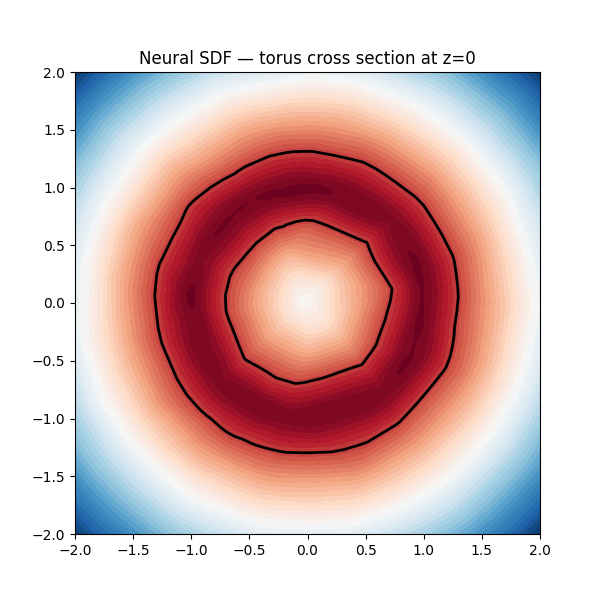

# Neural SDF Research

An alternative rendering path where, instead of evaluating an analytic SDF at query time, we approximate the distance field with a small neural network and bake the result into a 3D lookup table stored in BRAM. The RTL interpolates between BRAM samples using trilinear interpolation at runtime.

This was a research/exploration thread running in parallel with the main analytic ray marcher. It's not currently connected to the main render pipeline but all RTL modules simulate correctly.

---

## Software side (`Software_Neural/`)

### Network architecture

MLP: `3 → 32 → 32 → 32 → 1`, ReLU activations. Input is a 3D point (x, y, z) in the range [−2, 2]. Output is the signed distance to the surface.

### Training

Each shape has its own training script:

| Script | Shape | Test loss |
|--------|-------|-----------|
| `sphere_test.py` | Sphere | ~3×10⁻⁵ |
| `torus_test.py` | Torus | ~5×10⁻⁵ |
| `stanford_bunny_test.py` | Stanford bunny | experimental |

Training uses PyTorch with MSE loss against analytically computed SDF values sampled on a grid. Saved weights: `sphere_sdf.pth`, `torus_sdf.pth`.

### Weight export

`export_weights.py` loads a saved `.pth` file, quantises all weights and biases to Q4.12 (16-bit, 4 integer bits, 12 fractional bits), and writes them to `weights/w_*` and `weights/b_*` hex files — one value per line. These are loaded into BRAM by the RTL using `$readmemb`.

To run:
```bash
pip install torch numpy matplotlib trimesh
python sphere_test.py          # trains and saves sphere_sdf.pth
python export_weights.py       # quantise → weights/
python visualise.py            # plot the learned zero-contour
```

### Results


| Sphere | Torus |
|--------|-------|
|  |  |

---

## RTL side (`Neural_RTL/`)

The RTL inference path evaluates the network on a pre-baked 3D grid and uses trilinear interpolation for queries between grid points. This keeps the per-query latency constant regardless of network depth.

### Modules

| Module | Purpose |
|--------|---------|
| `neural_sdf_top.sv` | Top-level: connects baking_ctrl, sdf_bram, sdf_nn, trilinear_interp |
| `baking_ctrl.sv` | At startup, sweeps all grid points and writes SDF values to BRAM |
| `sdf_nn.sv` | Runs the MLP forward pass: 3 layers of `neuron_layer` |
| `neuron_layer.sv` | One fully-connected layer with ReLU |
| `neuron.sv` | Single neuron: dot product + bias + ReLU |
| `neuron_ReLu.sv` | ReLU activation: `max(0, x)` |
| `sdf_bram.sv` | True dual-port BRAM: port A for baking writes, port B for query reads |
| `trilinear_interp.sv` | Interpolates between 8 BRAM corners surrounding the query point |
| `blend_lerp.sv` | Single lerp helper used by trilinear_interp |
| `fp_to_q4_12.sv` | FP27 → Q4.12 conversion at BRAM write time |
| `q4_12_to_fp.sv` | Q4.12 → FP27 conversion at BRAM read time |

### Baking flow

On reset release, `baking_ctrl` iterates over all (x, y, z) grid points in the BRAM, feeds each to `sdf_nn`, and writes the returned Q4.12 distance to `sdf_bram`. When the sweep is done, `baking_done` goes high and the marcher can start querying.

### Query flow

At render time, `trilinear_interp` receives the query point (x, y, z), reads the 8 surrounding BRAM entries, and interpolates. The result feeds into the march core in place of `scene_sdf`.

### Q4.12 format

16-bit fixed point: 1 sign bit, 3 integer bits, 12 fractional bits. Range: [−8, 8). Quantisation error is small enough for SDF marching (distances are smooth and the marcher is tolerant of small errors in the distance estimate).
