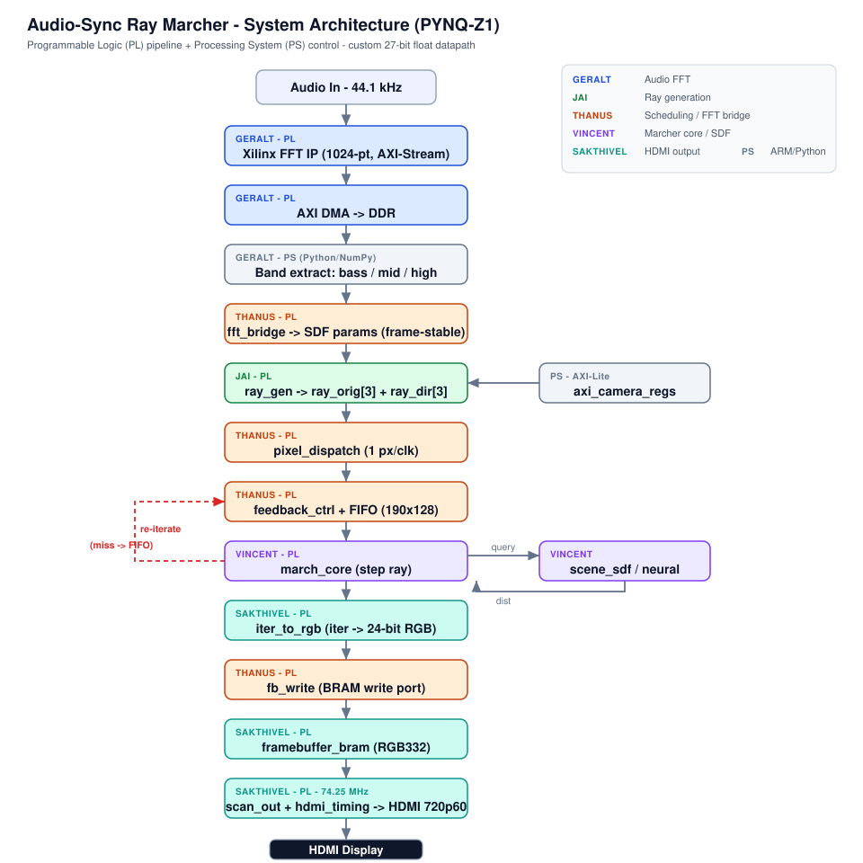
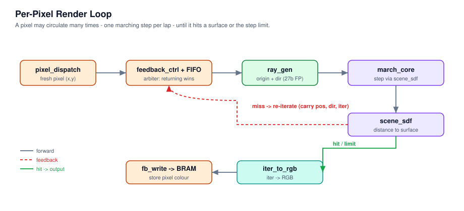
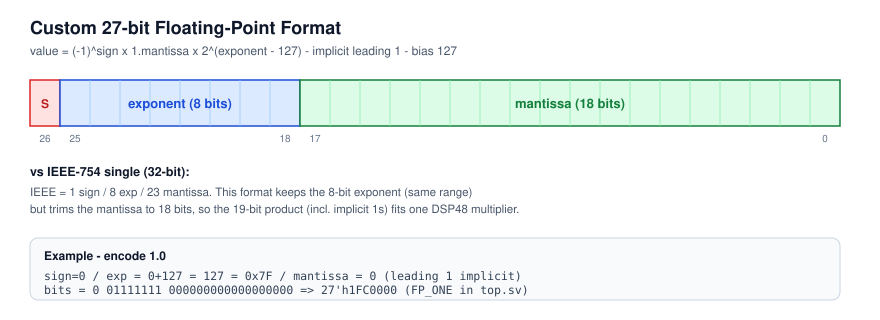
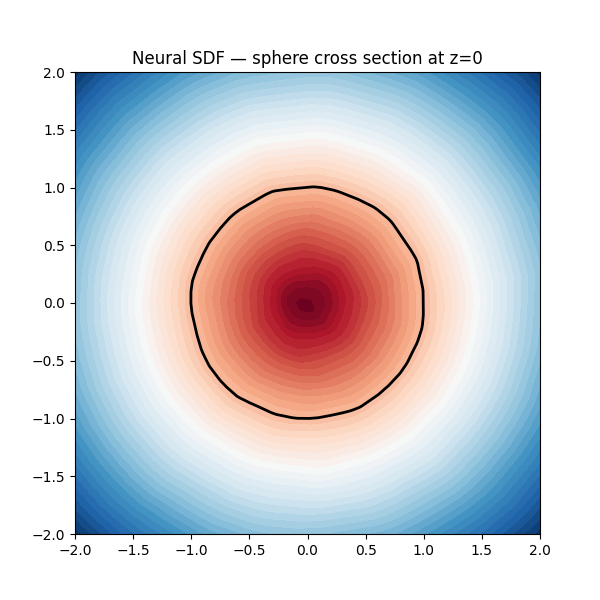

# FPGA Ray Marcher — PYNQ-Z1

A real-time 3D ray marcher built from scratch on the FPGA fabric of a PYNQ-Z1 (Zynq XC7Z020). No GPU, no CPU in the render loop. Every stage of the pipeline — floating-point arithmetic, ray generation, signed-distance evaluation, colour mapping, and HDMI output — is custom RTL running at 125 MHz on the PL.

**Imperial College London — Year 2 group project (EEE/EIE), June 2026.**

Note. If this "main" version has missing code, look in pre_final_scaffold. That one has all the working code no exception.
---

## What it does

For each of the 921,600 pixels in a 1280×720 frame, the hardware shoots a ray from the camera origin in the direction computed for that pixel, then steps along it repeatedly until it gets close enough to a surface (a "hit") or runs out of iterations. The distance to the surface at each step is evaluated by a signed-distance function (SDF) — a mathematical function that, given any point in 3D space, returns the distance to the nearest surface. Because the pipeline is fixed-latency, pixels don't loop in RTL; instead they recirculate through a FIFO, re-entering the pipeline for each march step.

When a pixel hits, its iteration count is mapped to an RGB colour and written to DDR3 over AXI4. The PS-side VDMA then streams that framebuffer to the HDMI output.

The system also renders in stereo: two eye positions separated by `HALF_IPD` (half inter-pupillary distance) are computed simultaneously, producing a side-by-side left/right image for the VR headset.

Camera position, orientation, and scene parameters are set at runtime from a Python script running on the Zynq PS over AXI-Lite — no recompilation needed to move the camera.

---

## Architecture overview

```
                    ┌─────────────────────────────────────────┐
                    │              PL (125 MHz)                │
                    │                                          │
   AXI-Lite ───────►│  axi_camera_regs ──► cam params         │
   (from PS)        │                          │               │
                    │  pixel_dispatch ──────────────────────►  │
                    │         │                │               │
                    │         ▼                ▼               │
                    │  feedback_ctrl ◄── march_core            │
                    │    (FIFO 190b)      (scene_sdf)          │
                    │         │                │               │
                    │         │     hit        ▼               │
                    │         └──────────► ddr_rgb_writer      │
                    │                          │               │
                    └──────────────────────────┼───────────────┘
                                               │ AXI4 master
                                               ▼
                                           DDR3 (PS)
                                               │
                                           VDMA (PS)
                                               │
                                           rgb2dvi IP
                                               │
                                           HDMI out
```



The render pipeline in more detail:

1. `pixel_dispatch` counts through raster order (x=0..WIDTH, y=0..HEIGHT), outputting one pixel coordinate per clock when `pipeline_ready` is high.
2. `feedback_ctrl` decides whether to feed a fresh pixel or a returning ray into the march core. Returning rays take priority — this prevents FIFO overflow. It holds a 190-bit-wide FIFO of in-progress rays (20 bits pix_id + 81 bits position + 81 bits direction + 8 bits iteration count).
3. `ray_gen` turns pixel coordinates into a normalised ray direction in world space using the camera lookat matrix. For returning rays the direction is passed through unchanged.
4. `march_core` evaluates one SDF step: it calls `scene_sdf`, adds `sdf_dist × step_scale` to the current position, and checks whether to hit, miss, or continue.
5. Hits go to `ddr_rgb_writer` which writes RGB24 to DDR3. Misses go back to `feedback_ctrl` via the FIFO.
6. The VDMA streams the completed framebuffer from DDR3 to `rgb2dvi`, which produces TMDS differential pairs for HDMI at 720p60.



---

## Custom 27-bit floating point (FP27)

Standard 32-bit IEEE 754 was too wide for efficient DSP48 use on the Artix-7. The DSP48E1 has an 18×27 bit multiplier — so we defined our own format sized to fit:

```
 bit 26    bits 25:18     bits 17:0
┌────────┬─────────────┬──────────────────────┐
│  sign  │  exponent   │      mantissa        │
│  (1b)  │  (8b, b127) │      (18b)           │
└────────┴─────────────┴──────────────────────┘
```

Exponent bias is 127, same as IEEE 754 single. No denormals, no NaN — the hardware assumes inputs are always valid finite numbers in the range the marcher produces. Multiplication maps onto a single DSP48E1 slice (18×18 product, upper 18 bits taken as the mantissa result).



All modules in `RTL/FP_Lib/` share the same interface: `clk`, `a[26:0]`, `b[26:0]` (or just `a` for unary), `out[26:0]`. Operands are cycle-aligned across the pipeline using `state_pipe.v`, which infers SRL32 shift registers in Vivado.

### Key constant encodings

| Value | FP27 hex | How |
|-------|----------|-----|
| 0.0 | `27'h0` | sign=0, exp=0 (underflows to zero) |
| 1.0 | `27'h1FC0000` | sign=0, exp=127, mantissa=0 |
| 2.0 | `27'h2000000` | sign=0, exp=128, mantissa=0 |
| 1.5 | `27'h1FE0000` | sign=0, exp=127, mantissa=2^17 |
| −1.0 | `27'h3FC0000` | sign=1, exp=127, mantissa=0 |

### Full library

| Module | Op | Latency (cycles) | Notes |
|--------|-----|---------|-------|
| `fp_add.v` | a + b | 4 | Aligns mantissas, adds, renormalises |
| `fp_sub.v` | a − b | 4 | Same as add with b sign flipped |
| `fp_mul.v` | a × b | 4 | One DSP48E1 per instance |
| `fp_isqrt.v` | 1/√a | 16 | Quake magic number + 1× Newton-Raphson |
| `fp_length.v` | √(x²+y²+z²) | 32 | 3×fp_mul + 2×fp_add + fp_isqrt + fp_mul |
| `fp_normalize.sv` | v/‖v‖ | 36 | fp_length + 3×fp_mul |
| `fp_abs.v` | \|a\| | comb | Clear sign bit |
| `fp_max.v` | max(a,b) | comb | Comparator + mux |
| `fp_min.v` | min(a,b) | comb | Comparator + mux |
| `fp_negate.v` | −a | comb | Flip sign bit |
| `fp_mod2.v` | a mod 2 | pipelined | Used for domain repetition |
| `fp_mul_vec3_mat33.sv` | v·M | pipelined | 9×fp_mul + 6×fp_add |
| `int2fp.v` | int → FP27 | comb | For pixel coords in ray_gen |
| `fp_div.sv` | a / b | pipelined | fp_isqrt + fp_mul |
| `fp_floor.sv` | floor(a) | pipelined | |
| `fp_mod.sv` | a mod b | pipelined | |
| `fp_inverse.sv` | 1/a | pipelined | |

---

## The march loop in detail

### Ray generation (`RTL/core/ray_gen.sv`)

Takes pixel coordinates (x, y) and the 3×3 camera lookat matrix (right, up, forward vectors) and produces a normalised ray direction in world space.

Steps:
1. Convert integer pixel (x,y) to centred normalised device coordinates: `ndc_x = (x - W/2) / W`, `ndc_y = (y - H/2) / H`.
2. Multiply by FOV constant and the lookat matrix to get the ray direction in world space.
3. Normalise using `fp_normalize`.

For stereo, `march_core` splits each pixel into left and right eye origins by offsetting `cam_origin` by `±HALF_IPD × lookat_right`. The two rays share the same direction but diverge from different origins.

Total latency: **48 cycles**.

### March core (`RTL/core/march_core.sv`)

One pass through `march_core` advances a ray by one SDF step:

1. The current position `(pos_x, pos_y, pos_z)` is passed through optional domain repetition (`repeat_mod_cell`), folding the ray into a tiling cell.
2. The folded position is passed to `scene_sdf` which returns the signed distance to the surface.
3. `new_pos = pos + ray_dir × sdf_dist × step_scale` (clamped to avoid overshooting).
4. If `sdf_dist < HIT_THRESH` → hit, output pixel to `ddr_rgb_writer`.
5. If `iter == MAX_ITER` → background colour.
6. Otherwise → output to feedback FIFO for another pass.

`state_pipe` instances keep `pos`, `dir`, `pix_id`, and `iter` aligned to the SDF output latency, which varies per scene. Each scene has a `SCENE_CORE_LAT` parameter, and `SDF_LAT = REPEAT_LAT + SCENE_CORE_LAT`.

### Domain repetition (`RTL/core/repeat_mod_cell.sv`)

Tiles the scene infinitely in XZ by mapping position `p` into `[-half_cell, +half_cell]`:

```
q = (p + half_cell) mod cell_sz − half_cell
```

Standard `mod` on negative inputs gives a negative remainder in FP, which would shift the geometry off-centre. `repeat_mod_cell` detects and corrects this. Latency: 18 cycles.

---

## SDF scenes

### Twisted torus (`RTL/sdf/twisted_torus_sdf.v`) — working on hardware

A standard torus with a domain twist applied along the Y axis: the XZ plane is rotated by `angle = py × TWIST` before the torus SDF is evaluated, producing a helical twist. `cos` and `sin` are approximated using Taylor series (1 − θ²/2 and θ − θ³/6 respectively).

`SCENE_CORE_LAT = 101`

<!-- Twisted torus render from hardware HDMI output -->
<!--  -->

<!-- Twisted torus PPM from Verilator sim -->
<!--  -->

### Menger sponge (`RTL/sdf/NOTWORKINGmenger_sdf.sv`) — sim verified, HW dispatch issue

Three-level box-frame IFS (Iterated Function System). At each level, the position is folded using `abs` and recentred, then the box-frame SDF is evaluated on the scaled-down result. Domain repetition tiles the sponge with `repeat_mod_cell` in XZ.

`SCENE_CORE_LAT = 83`, `REPEAT_LAT = 18`, `SDF_LAT = 101`

<!-- Menger sponge PPM from Verilator simulation -->
<!-- Generate: cd SIM_testbenches && make menger_ppm && open menger.ppm -->
<!--  -->

### Mandelbox (`RTL/sdf/NOTWORKINGmandelbox.sv`) — sim verified, needs adding to Vivado

4-iteration orbit trap with scale = −1.5. Each iteration applies:
1. `fp_clamp1`: clamp each component to [−1, 1] (combinational)
2. `z = 2×clamp(z) − z` (fold)
3. Spherical fold: if `|z| < minRadius`, scale; if `|z| < fixedRadius`, scale
4. `z = scale×z + c`

After 4 iterations, the SDF is `length(z) × scale_factor`.

`fp_clamp1` and `fp_times2` are purely combinational (a comparator + mux, and a 1-bit exponent increment respectively), keeping the 4-iteration loop tight.

`SCENE_CORE_LAT = 234`, `REPEAT_LAT = 0` (no spatial tiling)

Inside-point test results (from Verilator testbench, all 9 pass):
- Origin (0,0,0): SDF ∈ [0.000, 0.010] ✓
- Inside sphere (0,0,−1): SDF ∈ [0.000, 0.500] ✓
- Near bounding sphere (2.5,0,0): SDF ∈ [0.000, 2.000] ✓

<!-- Mandelbox PPM from Verilator simulation -->
<!-- Generate: cd SIM_testbenches && make mandelbox_ppm && open mandelbox.ppm -->
<!--  -->

---

## Render outputs

### Hardware HDMI

<!-- Photograph of the PYNQ-Z1 HDMI output on a monitor -->
<!--  -->

<!-- Photograph of stereo side-by-side image for VR headset -->
<!--  -->

### Simulation PPM renders

These are generated by the Verilator C++ testbenches and reflect exactly what the RTL produces, pixel-accurate:

<!--  -->
<!--  -->
<!--  -->

### GPU reference renders (OpenGL / ShaderToy)

Software reference implementations used during development to validate the SDF maths before committing to RTL. In `GPURenders/`:

<!--  -->
<!--  -->

---

## VR headset

We designed a VR headset enclosure in SolidWorks that holds a small screen driven by the PYNQ-Z1 HDMI output and mounts onto a Meta Quest 3 head strap. The stereo rendering in the RTL (two eye origins separated by `HALF_IPD`) produces the left/right image pair.

Full CAD files in `CAD/` — see [CAD/README.md](CAD/README.md).

<!-- Photo: assembled headset -->
<!--  -->

<!-- Photo: headset worn -->
<!--  -->

---

## Neural SDF (research path)

A parallel research thread: instead of an analytic SDF, train a small MLP to approximate the distance field, bake the result into a 3D grid stored in BRAM, and use trilinear interpolation at query time.

Network: `3 → 32 → 32 → 32 → 1`, ReLU activations. Weights exported as Q4.12 (16-bit fixed point) for `$readmemb`. Training losses: sphere ~3×10⁻⁵, torus ~5×10⁻⁵.

The RTL inference path (`Neural_SDF_Research/Neural_RTL/`) is independent of the main render pipeline and would slot in as a drop-in replacement for `scene_sdf`.

Full details: [Neural_SDF_Research/README.md](Neural_SDF_Research/README.md).



| Sphere | Torus |
|--------|-------|
|  |  |

---

## PYNQ control

All camera and scene parameters are written to the PL at runtime via AXI-Lite. No bitstream regeneration is needed to move the camera or change scene geometry.

`SCRIPTS/PYNQ/ctrl.py` sets up the VDMA (frame buffer addresses, stride, size), then starts a TCP server that accepts camera packets from `SCRIPTS/Computer/camera_mmio_controller.py` running on a laptop. Each packet contains 12 floats: the 3×3 lookat matrix and 3D camera origin. Scene parameters (cell size, shape size, RGB colours, audio energy values) are also writable at runtime.

`SCRIPTS/PYNQ/ui_base_selector.py` provides a simple on-board UI (visible via the PYNQ web interface) for switching between the base Vivado design and the ray marcher.

Full details: [SCRIPTS/README.md](SCRIPTS/README.md).

---

## Repository layout

```
SummerProjectMathsAccelerator/
├─ RTL/
│  ├─ FP_Lib/          Custom 27-bit floating-point library (16 modules)
│  ├─ core/            Ray generation, march core, domain repeat, state pipe
│  ├─ sdf/             SDF scenes: twisted torus, menger, mandelbox, sphere
│  ├─ control/         Pixel dispatch, feedback FIFO controller
│  ├─ video/           DDR3 AXI4 writer, colour palette
│  └─ top/             Top-level wiring: top.sv, top_ps.sv (PS wrapper)
├─ SIM_testbenches/    Verilator C++ PPM renders + SV unit testbenches
├─ VivadoDesigns/      Vivado block design, UI notebook, bitstream handoff
├─ ip_repo/            axi_camera_regs AXI-Lite IP, rgb2dvi HDMI IP
├─ constraints/        XDC pin constraints for PYNQ-Z1
├─ ip/                 Vivado-generated IP outputs (clk_wiz, rgb2dvi)
├─ CAD/                SolidWorks VR headset parts and assembly
├─ SCRIPTS/            PYNQ Python control, PC camera sender, Vivado TCL
├─ GPURenders/         OpenGL and ShaderToy reference renders
├─ Neural_SDF_Research/ PyTorch MLP training + Q4.12 RTL inference path
└─ misc/images/        Architecture SVGs, pipeline diagrams, result images
```

See the README in each subfolder for details.

---

## Building and running

### Simulation (Verilator)

```bash
cd SIM_testbenches
make menger_ppm        # renders menger.ppm
make mandelbox_ppm     # renders mandelbox.ppm
```

### SV unit tests

```bash
cd SIM_testbenches
# Icarus or Questa required
bash run_all_tests.sh
```

### Hardware

1. Open `VivadoDesigns/UI_Vivado/` in Vivado 2020.x+.
2. Run synthesis, implementation, generate bitstream.
3. Program the PYNQ-Z1.
4. On the board: `python3 SCRIPTS/PYNQ/ctrl.py`
5. On the PC: `python3 SCRIPTS/Computer/camera_mmio_controller.py`

**Hardware requirements:** PYNQ-Z1 · HDMI 720p60 display · Vivado 2020.x+ · Python 3 (pynq, numpy, struct, socket)

---

**Status (June 2026):** twisted torus rendering on hardware. Menger sponge RTL verified in simulation — dispatch bug (frame_ready_valid stuck) under investigation. Mandelbox RTL verified in simulation — needs adding to Vivado project before hardware test. Neural SDF path functional in simulation.
